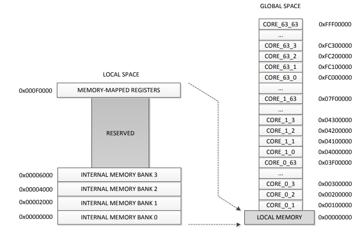

##############################################
Distributed shared memory management in RTFP
##############################################

Overview
----------------------------------

Each core on the Epiphany processor has independent local memory which can regarded as distributed shared memory, it is accessible by other Epiphany cores and the host arm processor as well. This ditributed shared memory will be used to store variables (labels) that are shared between tasks. Also, it will be accessed regularly by the host ARM processor to get the status of the core and information on its operation at any given point in time.  

shared variables (labels) are allocated in the distributed shared memory statically. 

The labels are grouped together by size in contiguous memory blocks.

Distributed shared memory model
------------------------------------

User accessible memory address space on core ranges from core_address + 0x0000 to address core_address + 0x7FFF with core_address referring to the start address of the core in the global address space, within this address space, all shred labels should assigned. This memory is divided into 4 memeory banks. Access to those memory banks can be restricted individully. 

This figure shows the memory model of Epihany cores, the memory map is explained in more detail `here <http://www.adapteva.com/docs/epiphany_arch_ref.pdf>`_. 

All labels of the same type will be allocated to an array of that type. Accessing those labels can be done by simply accessing the index of the array. 

Distributed shared memory initialization and allocation in RTFP
------------------------------------------------------------------

Each distributed shared memory section will be initialized individually. If the code using RTFP is automatically generated, initialization function will be replecated for each section. 
To intialize a new shared memory section in RTFP, the following steps are required:

*	Declare the section as an array of the desired type and number of labels globally Example:
.. code-block:: CPP

   	unsigned int *outbuf_dstr_shared[10];

In this example, a block of 10 labels, each of which is of size unsigned int has been declared. Similarly, any other type could be declared. For label blocks that are too large to be declared as a standard C type, blocks of structs can also be declared. 

*	Allocate the declared memory block (array) in shared memory, example:

.. code-block:: CPP

   	//allocate initial address
	outbuf_dstr_shared[0] = (unsigned int *) dstr_shared_mem_section;
	//allocate other addresses sequentially
	for (int i=1;i<shared_section_label_num;i++){
		outbuf_dstr_shared[i] = outbuf_dstr_shared[i-1] + 1;
	}

where dstr_shared_mem_section is a macro defined with the start address of the block to be allocated, and shared_section_label_num is the number of labels in that section.

shared memory access in RTFP
----------------------------------------------------

Declared memory sections in RTFP are pointers to actual memory addresses. In order to write to a given label in a section, the relative address in the core will be given by the index and that will be added to the base address of the core memory to find the absolute address of the variable (label) to be written.

.. code-block:: CPP

   	unsigned int *addr;
	unsigned int* addr_base;
	addr_base = get_base_address_core(row,col);
	addr = (unsigned int*) ((unsigned ) addr_base | (unsigned)outbuf_dstr_shared[label_indx]);
	*addr = payload;

Similarly to read the label:

.. code-block:: CPP

   	unsigned int *addr;
	unsigned int* addr_base;
	addr_base = get_base_address_core(row,col);
	addr = (unsigned int*) ((unsigned ) addr_base | (unsigned)outbuf_dstr_shared[label_indx]);
	return *addr;

Where *addr will return the value at the requested label_indx.

In order to access the declared memory section anywhere in the project, the read and write operations should be wrapped into functions. Example:

.. code-block:: CPP

   	uint8_t shared_label_write	(int label_indx,int payload);

	unsigned int shared_label_read_core (unsigned row, unsigned col, int label_indx);

Those functions could be replicated for different sections.