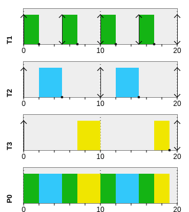
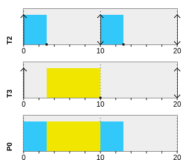
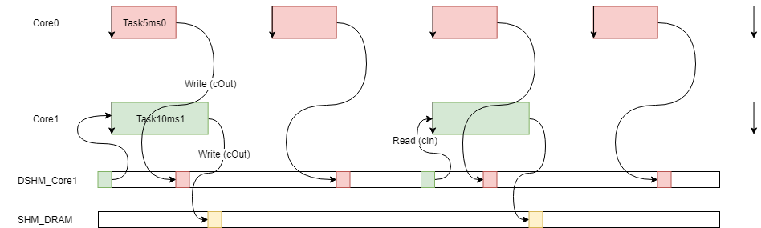

###################################################
Example amalthea model
###################################################

This page describes the example amalthea model implemented in RTFP. 

The implementation of this example can be found in `core0_main.c` and `core1_main.c` sorce files. 

Two examples for visualizing this model using the host processor are also provided in `armcode.c` and `host_example1.c`.  

Overview
------------------------------------------

The model implemented in this example has the following attributes:

+-----------------------+----+
| Number of cores       | 2  | 
+-----------------------+----+
| Number of tasks       | 5  | 
+-----------------------+----+
| Number of event chains| 1  |
+-----------------------+----+

The tasks implemented in this core have the following attributes:

+-----------------------+-------------+------+----------+--------------+
| Task name             | task period | WCET | deadline | core mapping |
+=======================+=============+======+==========+==============+
| task5ms0              | 5  mS       | 2 mS |   5 mS   | Core 0       |
+-----------------------+-------------+------+----------+--------------+
| task10ms0             | 10 mS       | 3 mS |  10 mS   | Core 0       |
+-----------------------+-------------+------+----------+--------------+
| task20ms0             | 20 mS       | 5 mS |  20 mS   | Core 0       |
+-----------------------+-------------+------+----------+--------------+
| task10ms1             | 10 mS       | 3 mS |  10 mS   | Core 1       |
+-----------------------+-------------+------+----------+--------------+
| task20ms1             | 20 mS       | 7 mS |  20 mS   | Core 1       |
+-----------------------+-------------+------+----------+--------------+

The used cores are mapped on Epiphany cores as follows:

+-------------------+---------------------+------------------------+
| Core name         | Epiphany device row | Epiphnay device column |
+===================+=====================+========================+
| Core0             |         0           |           0            |
+-------------------+---------------------+------------------------+
| Core1             |         1           |           0            |
+-------------------+---------------------+------------------------+

The model has the following shared memories in separate locations. Each of the shared memory locations holds one memory section that has 10 contiguous labels of size :envvar:`unsigned int`. The shared memories are shown in the following table:

+-------------------------+---------------------+--------------------------+
| Shared memory location  | Shared memory sections | section label size    |
+=========================+========================+=======================+
| DRAM                    |         1              | `unsigned int`        |
+-------------------------+------------------------+-----------------------+
| Core0                   |         1              | `unsigned int`        |
+-------------------------+------------------------+-----------------------+
| Core1                   |         1              | `unsigned int`        |
+-------------------------+------------------------+-----------------------+

RMS scheduling of the model
----------------------------------------

The model has been simulated using the Rate Monotonic (RM) scheduling policy. The simulation has been performed using `simso <http://projects.laas.fr/simso/simso-web>`_. The gantt charts shown here explain the task scheduling behavior that is desired from any scheduler that follows the RMS policy. 

The output from RTFParallella after realizing this behavior sould be as follows:

.. code-block:: bash

	RFTP demo started 
	===========================================================================
      |   Tasks being executed  | observed labels values |
 tick |   Core 1   |   Core 2   |
	===========================================================================
    1 |   Task5ms0 |  Task10ms1 |
    1 |   Task5ms0 |  Task10ms1 |
    2 |  Task10ms0 |  Task10ms1 |
    3 |  Task10ms0 |  Task20ms1 |
    4 |  Task10ms0 |  Task20ms1 |
    5 |   Task5ms0 |  Task20ms1 |
    6 |   Task5ms0 |  Task20ms1 |
    6 |   Task5ms0 |  Task20ms1 |
    7 |  Task20ms0 |  Task20ms1 |
    8 |  Task20ms0 |  Task20ms1 |
    9 |  Task20ms0 |  Task20ms1 |
   10 |   Task5ms0 |  Task10ms1 |
   11 |   Task5ms0 |  Task10ms1 |
   12 |  Task10ms0 |  Task10ms1 |
   13 |  Task10ms0 |    no task |
   14 |  Task10ms0 |    no task |
   15 |   Task5ms0 |    no task |
   16 |   Task5ms0 |    no task |
   17 |  Task20ms0 |    no task |
   18 |  Task20ms0 |    no task |
   19 |    no task |    no task |
   20 |   Task5ms0 |  Task10ms1 |

Example task implementation 
------------------------------------

Utilities explained earlier are used to realize the tracing of tasks while being executed and switched. 

.. code-block:: CPP

	void handler10ms(){
		updateDebugFlag(800);
		sleepTimerMs(3,2);
		passes2++;
		traceTaskPasses(2,passes2);
		traceRunningTask(0);
	}

The task is traced within the sleep function while it runs (sleeps if there is no behavior to be performed), and once it completes the sleep period, the job instance of the task will be updated and traced, and the running task flag in output buffer will be voided to 0 to indicate that the core is now idle. Until another task runs and updates the output buffer. 

Example event chain implementation
---------------------------------------

Shared and distributed shared memory management utilities described earlier are used to implement a simple task chain consisting of two tasks, a `producer` and a `consumer`. Namely, the task :envvar:`task5ms0` being the producer and the :envvar:`task10ms1` being the consumer task. They share one label in the distributed shared memory of core 1. The output of the event chain is a label in the shared memory of the parallella system. 

The input to the event chain is a local label in the producer task that is inceremented by the end of each instanceof the task. This local label simulates data coming from a sensor in an automotive application. 

The event chain data propagation is shown in the following figure. Note that the consumer task :envvar:`task10ms1` is oversampling the producer task.

