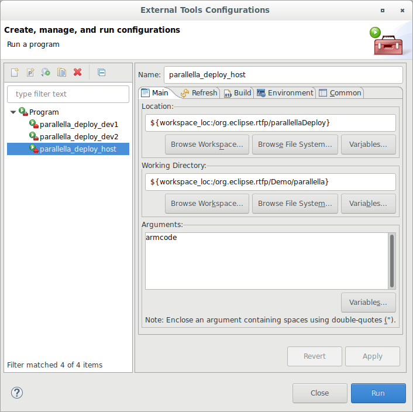

#######################################
Binary deployment on Parallella 
#######################################

This file explains the process of deplyment of software artifacts generated on a development machine to the Parallella board and running those artifacts on Parallella. 

.. _RST parallella_deployment:

Deployment Script
------------------------

The deplyment script can be found under

.. code-block:: bash

   /parallellaDeploy.sh

Deployment parameters
-------------------------

The deployment script has the following parameters. Those parameters are to be changed for the particular parallella board and development machine used :

*	:envvar:`HOST_NAME`			: Replace with IP address or host name of parallella 
*	:envvar:`HOST_USER`			: Replace with name of the user with privilige to execute files in :envvar:`HOST_OFFLOAD_PATH`.
*	:envvar:`HOST_OFFLOAD_PATH`	: Replcae with desired execution path on parallella board file system (usually this will be a folder under :envvar:`home`).
*	:envvar:`PORT`				: Replace with the SSH port on parallella board (usually 22).
*	:envvar:`KEY`				: replace with the absolute path to ssh the public SSH key file on the development host. 

Invocation of Deployemnt script
--------------------------------------

This script has one argument that must be passed when it is invoked. Namely, the file which should be deployed.

This script will be called automatically by eclipse once the launch configuration is set up. 

Eclipse launch configuration setup
-------------------------------------

The following steps show the process of setting up eclipse for deployment of binaries:

*	Each deployed binary will have its own launch configuration

*	Run -> External tools -> external tool configurations

*	New Launch Configuration 

*	Choose the name of the deplyment configuration (usually parallella_deployment_device_coreNum or parallella_deployment_host)

*	in Location, choose browse workspace 

*	choose the deployment script (in root folder of the project)

*	in working directory, choose browse workspace 

*	choose the folder that contains the binaries (/Demo/parallella)

*	in arguments, insert the name of the binary to be deployed with the extension (if any)

*	save the configuration

*	repeat the steps for all binaries. 

Known issues
-------------------------
The development host's SSH key must be listed as a trusted key in the parallella board authorized key file

.. code-block:: bash

   ~/.ssh/authorized_keys 

