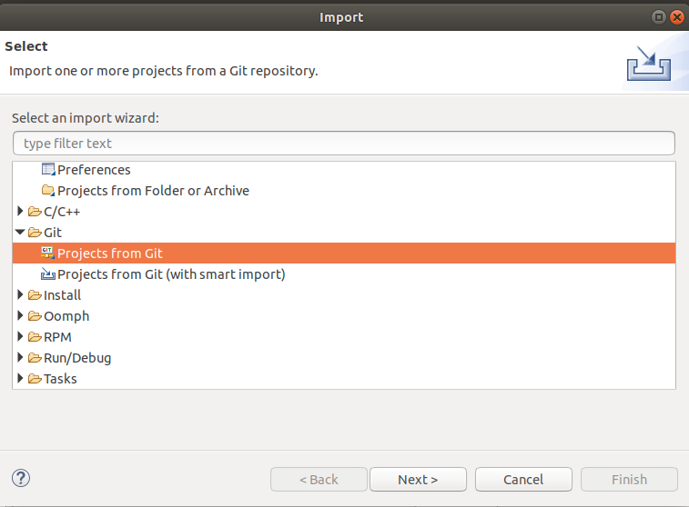

###########################
Adapteva Parallella setup 
###########################

This chapter will detail the process of setting up all tooling required for development on the parallella board for RTFP.

This setup is intended to be run on a linux machine, The steps shown here have been realized on an Ubuntu 18.04 system, it should also work with any other distributions -and versions- of linux.

Dependencies:
--------------------------

RTFP requires the following dependencies to allow successful compilation and deployment of binaries generated using the framework:

*	ESDK (Epiphany SDK) : v2016.11.
*	Eclipse for C/C++ developers. 
*	Linaro cross GCC toolchain.

.. _Sphinx Overview:

Cross compilation setup (steps):
------------------------------------

This framework usually requires cross compilation on a host machnine (development machine) and deployment to the Parallella board. 

This section will explain the setup for cross compilation. Deployment setup will be explained in a different section.

steps are as follows:

*	Download The Epiphany SDK (ESDK) from `Github <https://github.com/adapteva/epiphany-sdk/releases>`_. This framework has been written using the latest ESDK (v2016.11), it has not been tested on previous ESDK versions. 

*	The ESDK is released in 3 versions:

	*	armv7l: for compilation on the parallella board (this version has an arm-compatible GCC).
	*	x86-64: This is the version that was used for development of RTFP and it must be used for cross compilation of Parallella binaries on thelocal machine. 
	*	x86-64: This version could be used for simulating the operation of parallella on the local machine (requires at least 8GB of ram, for more details on that, refer to this `repository <https://github.com/parallella/parallella-examples/tree/master/simulator-tutorial>`_).

*	Create a directory at

.. code-block:: bash

   /opt/adapteva

*	unzip the tar.gz file here using the following command

.. code-block:: bash

   tar xf esdk.2016.11.x86_64.tar.gz

*	create a soft link for the ESDK folder, this step is optional, but wil simplify further operations as it is easier to type than the full name of the ESDK folder

.. code-block:: bash

   sudo ln -s esdk.2016.11 esdk

*	open the bash start up file 

.. code-block:: bash

   sudo nano ~/.bashrc 

*	Append the following to the end of the file

.. code-block:: bash

   EPIPHANY_HOME=/opt/adapteva/esdk
   . ${EPIPHANY_HOME}/setup.sh

*	restart terminal (to allow bash to intialize again)

*	For ARM code compilation, a gnubeahif cross compiler is needed. download the Linaro toolchain for cross compilation `here <https://releases.linaro.org/components/toolchain/binaries/7.2-2017.11/arm-linux-gnueabihf/gcc-linaro-7.2.1-2017.11-x86_64_arm-linux-gnueabihf.tar.xz>`_.

*	unzip the tool chain tar in the following folder

.. code-block:: bash

   /opt/linaro

*	Download Eclipse for C/C++ developers `here <https://www.eclipse.org/downloads/packages/>`_.

*	open eclipse 

*	File -> import -> git -> projects from git -> next

*	enter the URL of RFTP repository and import the project. 

*	test the setup by trying to build the project. 

Notes
--------------------------------

It is important to run eclipse from the terminal (to make sure bash is initialized), to allow make file invcation from within eclipse to recognize e-gcc (GCC compiler for Epiphany processor).

