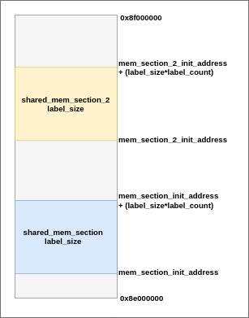

######################################
Shared memory management in RTFP
######################################

Overview
----------------------------------

Adapteva Parallella has a 1GB DRAM that includes a shared section which acts as a shared memory. This section is accessible by the Epiphany processor and the host arm processor as well. This DRAM section will be used to store variables (labels) that are shared between tasks.

Shared labels between tasks can also be stored on the local memories of epiphany cores. This mode of storage is discussed in the next chapter of this documentation.  

shared variables are allocated in the shared memory statically. 

The labels are grouped together by size in contiguous memory blocks, and can be used as elemnts in an array. 

Shared memory model
-------------------------------

Shared memory address space spans 16 MB of the DRAM. within this address space, all shared labels should assigned.
Shared memory between the epiphany processor and ARM host starts with address :envvar:`0x8e000000` and ends with address :envvar:`0x8f000000`.	

All labels of the same type will be allocated to an array of that type. Accessing those labels can be done by simply accessing the index of the array. 

This figure shows the memory model of DRAM on parallella. 

Shared memory initialization and allocation in RTFP
------------------------------------------------------------

Each shared memory section will be initialized individually. 
To intialize a new shared memory section in RTFP, the following steps are required:

*	Declare a struct of the type :envvar:`SHM_section`, Example:

.. code-block:: CPP

   	SHM_section example_sec = {0x01000000,10,INT_32};

In this example, a block of 10 labels, each of which is of size unsigned int has been declared, the base address of this section is :envvar:`0x8f000000`. Note that addresses given here are relative to the jointly accessible RAM section on the parallella and offsetted by :envvar:`0x01000000`. i.e. base adresses could range between :envvar:`0x01000000` and :envvar:`0x01ffffff`.

Similarly, any other type could be declared. For label blocks that are too large to be declared as a standard C type, blocks of structs can also be declared. 

*	Allocate the declared memory block (array) in shared memory using :envvar:`shm_section_init`, example:

.. code-block:: CPP

   	//Declare a struct with section attributes
	SHM_section example_sec = {0x01000000,10,INT_32};
	//allocate the section in memory
	//and assign a pointer to it
	unsigned int* sec_global_pointer = shm_section_init(example_sec);

After performing this operation, the pointer :envvar:`sec_global_pointer` points to the base address of this section and can be used to access any value within the section by index. (similar to array accesses).

Shared memory write operation in RTFP
----------------------------------------------------

Declared memory sections in RTFP are accessed by their pointers. In order to write to a given label in a section:

.. code-block:: CPP

   	//write to shared label
   	void write_shm_section (unsigned int* x, unsigned indx, int payload);

Where:

*	:envvar:`x` is the pointer to the declared section.

*	:envvar:`indx` is the index of the label being written to. Indices start from zero.

*	:envvar:`payload` is the value to be written. 

Shared memory read operation in RTFP
----------------------------------------------------

A read operation is similar to the write operationn described above. Only the section pointer and indes are needed for the access. 

.. code-block:: CPP

   	int read_shm_section (unsigned int* x, unsigned indx);

Where:

*	:envvar:`x` is the pointer to the declared section.

*	:envvar:`indx` is the index of the label being read. Indices start from zero.

This function returns the value of the shared label as an integer. The return type is used for simplicity 

known issues
-----------------------------------

*	Due to the semantics of task to task communication in Amalthea models, a copy of every shared label will have to be created at the beginning of the task. However, the stack size of every task is limited and therefore on certain Amalthea models, it might be required to adjust the task's stack to prevent stack overflow.

*	Access operations to the shared memory are not (yet) synchronised in RTFP. Race conditions may happen. This will be resolved in the next update of RTFP. with support for binary semaphores across cores on the Epiphany chip.

Future developments
------------------------------------

In the next release of RTFP, the following functionalities will be added to shared memory management:

*	Allocation of memory section will be done with the use of function calls instead of creating a pointer array. Each section will have a string identifier to refer to it throughout the code.

*	Support for synchronisation between memory accesses on single core and accross multiple cores will be added. 

*	Automatic allocation mechanism will be added to insure that sections are contiguous and hence avoid memory fragmentation. 